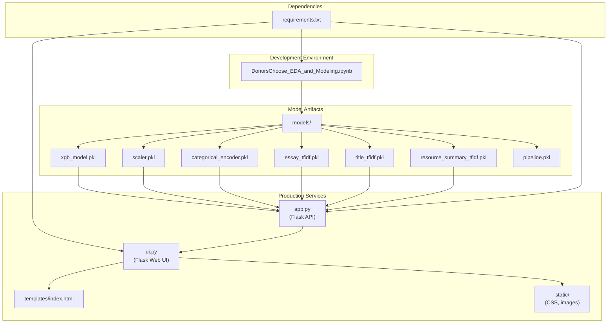

# 🔰 **DonorsChoose Project Success Predictor**

A Flask web app + REST API that predicts the likelihood of classroom project approval on **[DonorsChoose.org](https://www.donorschoose.org/)** using machine learning models.

---

## 🔥 Demo

### Web UI

Submit project details and instantly get a prediction.


### API Example

```bash
curl -X POST http://127.0.0.1:5000/predict \
     -H "Content-Type: application/json" \
     -d '{
    "teacher_prefix": "Mrs.",
    "school_state": "CA",
    "project_submitted_datetime": "2023-11-15 10:30:00",
    "project_grade_category": "Grades PreK-2",
    "project_subject_categories": "Literacy & Language, Math & Science",
    "project_subject_subcategories": "Reading, Early Childhood Education",
    "project_title": "Interactive Learning for Young Minds",
    "project_essay_1": "My kindergarten classroom is a vibrant space where young learners are eager to explore and discover the world around them. Many of my students come from low-income families and have limited access to educational resources at home. Providing them with engaging, hands-on materials is crucial for their foundational development.",
    "project_essay_2": "We are seeking a new set of interactive learning tablets and educational games designed to foster early literacy and numeracy skills. These tools will allow students to practice phonics, sight words, basic arithmetic, and problem-solving in an engaging, self-paced environment. They will also support personalized learning, catering to the diverse needs and learning styles within my classroom.",
    "project_essay_3": "",
    "project_essay_4": "",
    "project_resource_summary": "Interactive tablets and educational software to support early literacy and math.",
    "teacher_number_of_previously_posted_projects": 8,
    "resources": [
        {
            "description": "Educational Tablet (Kid-friendly)",
            "quantity": 5,
            "price": 99.99
        },
        {
            "description": "Early Learning Software License",
            "quantity": 1,
            "price": 150.00
        },
        {
            "description": "Headphones for tablets",
            "quantity": 5,
            "price": 15.00
        }
    ]
}'
```

Response:

```json
{
    "confidence_score": 0.6095346808433533,
    "predicted_approval": "Approved"
}
```

---

## ✨ Features

* **Flask REST API** for model inference
* **Interactive Web UI** for project evaluation
* **Pre-trained ML models**: XGBoost, Logistic Regression, SVM, Decision Tree
* **Text processing pipeline** for essays & project descriptions
* **Feature engineering** for metadata (grade, subject, resources, etc.)
* **Jupyter Notebook** for analysis, feature engineering, and model training

---

## 🏗️ System Architecture

```
     [ Web UI ]  ←→  [ Flask Backend ]  ←→  [ Pre-trained Models ]
        ↑
        |--- REST API (JSON)
```



---

## 📂 Project Structure

```
donors_choose_approval_prediction/
├── models/                                # Pre-trained ML models (.pkl)
├── static/                                # CSS, images
├── templates/                             # HTML templates
└── DonorsChoose_EDA_and_Modeling.ipynb    # EDA & Modeling
├── app.py                                 # Flask API backend
├── requirements.txt                       # Dependencies
└── ui.py                                  # Web UI
```

---

## ⚡ Quickstart

1. Clone repository:

   ```bash
   git clone <repo-url>
   cd donorschoose
   ```
2. Install dependencies:

   ```bash
   pip install -r requirements.txt
   ```
3. Run API service:

   ```bash
   python app.py
   ```
4. Run Web UI:

   ```bash
   python ui.py
   ```
5. Explore data & models in Jupyter:

   ```bash
   jupyter notebook notebooks/DonorChoose_org.ipynb
   ```

---

## 🛠️ Tech Stack

* **Flask** → Web framework (API + UI)
* **XGBoost / scikit-learn** → ML models
* **Pandas / NumPy / SciPy** → Data processing
* **Matplotlib / Seaborn** → Visualization
* **Jupyter Notebook** → Development & analysis

---

## 📘 Development

* Feature engineering on essays, titles, metadata
* Multiple model training: Logistic Regression, SVM, Decision Tree, XGBoost
* Pre-trained models saved in `models/` for inference
* End-to-end ML lifecycle: **EDA → training → deployment**

---

## 📜 License  

This project is licensed under the [MIT License](LICENSE).  


